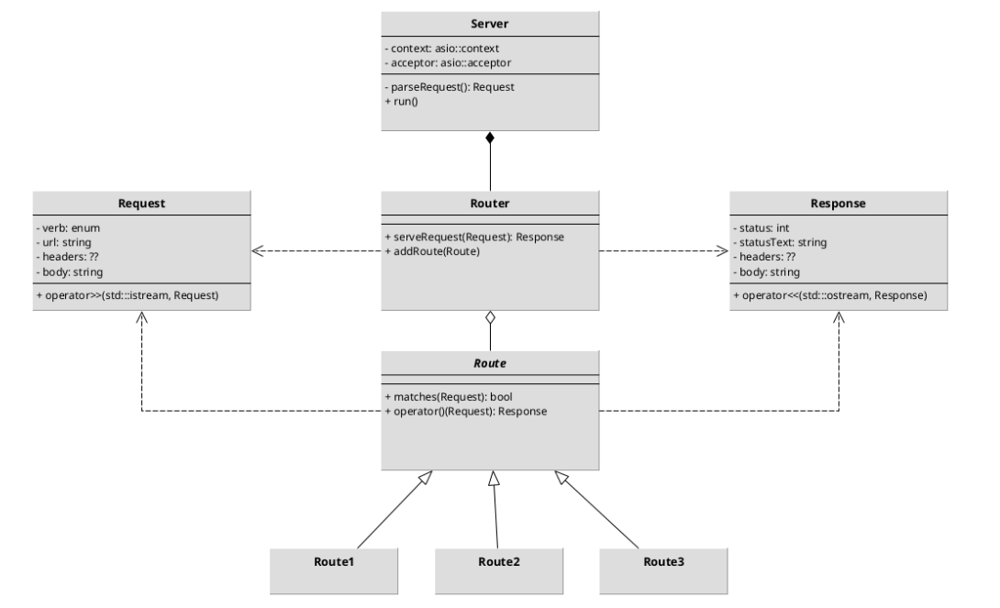

# Cpp-HTTP-Server

## Introduction

This project involves setting up a basic HTTP server in C++. The server is capable of handling HTTP requests, parsing them, and providing appropriate responses based on the defined routes. This server operates over the TCP protocol, enabling efficient and fast communication.

## Technical Architecture

### Main Components

1. **TCP Server**:
   - The server listens for incoming connections on a specified port (in this example, port 5555).
   - When a connection is established, the server creates a socket to manage communication with the client.

2. **HTTP Request Parsing**:
   - The server receives requests in HTTP format and uses the `Request` class to extract the necessary information (method, URL, headers, body).
   - Requests are parsed using overloaded stream operators to facilitate data reading.

3. **Routes**:
   - The server uses a router (`Router`) to manage different routes. Each route is defined by a URL and a method (GET or POST).
   - Routes are registered in the router and can be called based on the received request.
   - The project includes predefined routes such as:
     - **/course_info**: Returns the course name and authors.
     - **/image**: Returns an image stored locally.
     - **/submit**: Route to submit data via a POST request.



4. **Response Generation**:
   - Once the request is processed, the server generates an HTTP response using the `Response` class.
   - Responses contain appropriate headers, HTTP status, and the body of the response, which is then sent back to the client.

### Usage

#### Compile the Project

To compile the project, run the following command in the terminal:

```bash
g++ -I. main.cpp request.cpp server.cpp router.cpp route.cpp response.cpp -o tp2
```

#### Launch the Server

Once the project is compiled, you can launch the server with the following command:

```bash
./tp2
```

#### Communicate with the Server

There are several ways to communicate with the server once it is running:

1. **Using Netcat**:
   - To send a POST request:
     ```bash
     nc localhost 5555 < data/req_post_example.txt
     ```
   - To send a GET request:
     ```bash
     nc localhost 5555 < data/req_get_example.txt
     ```

2. **Using a Web Browser**:
   - Access the following routes in your browser:
     - **`localhost:5555/course_info`**: To get the course name and authors.
     - **`localhost:5555/image`**: To get the locally stored image.
     - **`localhost:5555/submit`**: To submit a POST request (make sure to use a tool like Postman or Netcat for POST requests, as browsers send GET requests by default).

## Conclusion

This project illustrates the fundamental principles of creating an HTTP server in C++, including handling TCP requests, parsing HTTP requests, managing routes, and generating responses. It provides a solid foundation for understanding how modern web servers operate.